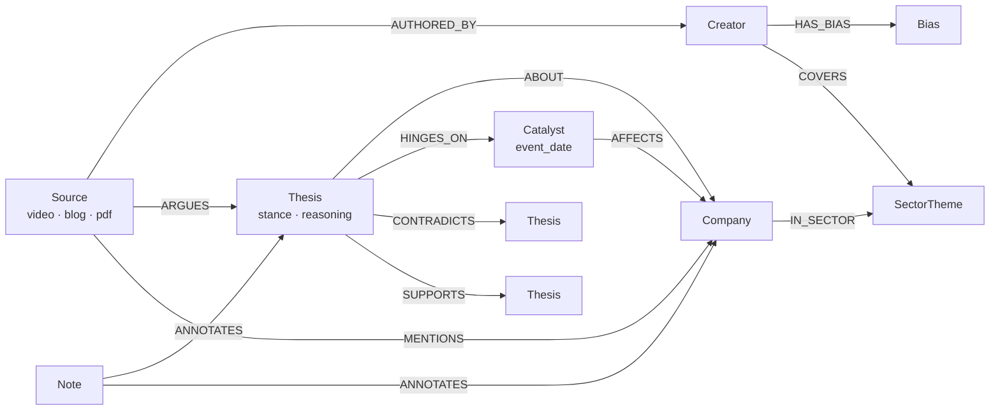
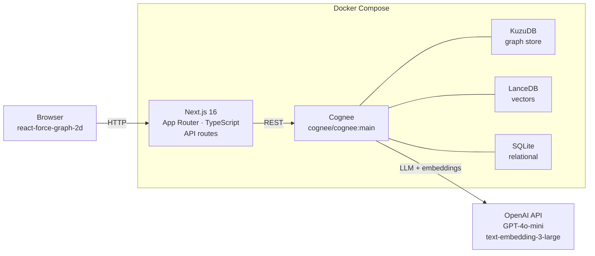

# InvestorBrain

**Bias-aware, contradiction-aware investing memory.**

[](LICENSE) [](https://nextjs.org/) [](https://github.com/topoteretes/cognee) [](https://www.typescriptlang.org/)

---

## The problem

Retail investors consume investing content across dozens of fragmented sources — finfluencer YouTube channels, independent Substacks, broker research notes, blog posts — and retain almost none of it. Each thesis lives in isolation; contradictions between creators go unnoticed; context dissolves between sessions. Vector-RAG "chat with your docs" tools offer a false solution: they retrieve semantically similar text, but they cannot surface which analysts disagree, which theses hinge on overdue catalysts, or whose optimism you should discount because every call they make is bullish. These are multi-hop graph queries, and a flat similarity index structurally cannot answer them.

---

## What it does

InvestorBrain turns every piece of investing content you consume into a node in a typed knowledge graph. Each source is parsed, its entities extracted by a domain-specific prompt, and the result written into a self-hosted Cognee memory engine — KuzuDB graph store, LanceDB vectors, SQLite metadata — running on your own server. The graph is then queryable in plain language, with citations, contradictions surfaced, and creator bias accounted for.

### Memory lifecycle

| Operation | What it does | Cognee endpoint |
|---|---|---|
| **remember** | Ingest a URL or paste a note → extract typed nodes (Company, Thesis, Catalyst, Creator…) and edges → write to graph | `POST /api/v1/remember` |
| **recall** | Natural-language query → hybrid graph + vector search → answer with source attribution | `POST /api/v1/recall` |
| **improve / memify** | Merge duplicate nodes, detect `CONTRADICTS` edges across sources, link new theses to prior analogues | `POST /api/v1/improve` + `/api/v1/memify` |
| **forget** | Delete a debunked thesis, untrusted creator, or stale source — and all derived edges — cleanly | `POST /api/v1/forget` |

### Queries the graph answers that vector search cannot

- **Bull vs. bear, attributed:** "What is the bull case and bear case on HDFC Bank, and who argues each side?" — traverses Source → Creator and Thesis → stance across multiple documents in one query.
- **Creator contradictions:** "Where do the analysts I follow contradict each other on Zomato?" — walks explicit `CONTRADICTS` edges between Thesis nodes, traces back to the Source and Creator of each.
- **Catalyst-gated theses:** "Which of my saved theses hinge on a catalyst due this quarter?" — filters Thesis → `HINGES_ON` → Catalyst by `event_date`.
- **Bias-discounted optimism:** "Show bullish theses on Reliance where every supporting creator is tagged permabull or sell-side" — 4-hop join: Thesis → Source → Creator → `HAS_BIAS` → Bias.
- **View evolution:** "How has my understanding of the Indian banking sector evolved over six months?" — orders Source nodes by `ingestedAt`, traces Thesis stance drift over time.

Each of these is a 2–4 hop graph join over typed relationships. Semantic similarity search cannot perform them because the edges it would need — `CONTRADICTS`, `HAS_BIAS`, `HINGES_ON` — do not exist in a vector index's representation.

---

## Knowledge graph

The domain ontology (`web/ontology/investing.owl`) defines eight node types and twelve typed relationships and is uploaded to Cognee at startup via `POST /api/v1/ontologies`. Extraction is driven by a custom `graph_model` JSON schema plus a replacement system prompt, both defined in `web/lib/extraction.ts` and passed to Cognee on every ingest. This forces the LLM to emit only domain-typed nodes — no generic `Entity` or `Person` nodes — producing a graph that is genuinely graph-shaped rather than a labelled document store.



**The three differentiating edges:** `CONTRADICTS` / `SUPPORTS` (Thesis ↔ Thesis), `HINGES_ON` (Thesis → Catalyst), and `HAS_BIAS` (Creator → Bias). These relationships are what makes the graph feel like it has judgment rather than just recall. The `CONTRADICTS` edge in particular is surfaced automatically during `improve()` — you do not have to mark disagreements manually.

---

## Architecture

Every line of application code is TypeScript. Cognee is consumed purely as a self-hosted open-source service over its REST API — there is no Python in this repository. The full stack runs comfortably on an 8 GB VPS.



**Why no self-hosted model:** offloading inference to the OpenAI API keeps RAM requirements minimal — the 8 GB ceiling is occupied by the graph and vector stores, not model weights. Swapping to any LiteLLM-compatible provider (Gemini, Anthropic, Ollama) requires only changing `LLM_PROVIDER` and `LLM_MODEL` in `.env`.

---

## Quickstart (local)

**Prerequisites:** Docker, Node.js 20+, pnpm, OpenAI API key.

```bash
# 1. Clone
git clone https://github.com/vinaybajjuri58/investorbrain
cd investorbrain

# 2. Configure
cp .env.example .env
# Open .env and set LLM_API_KEY to your OpenAI key (sk-...)

# 3. Start Cognee
docker compose up -d
# Healthy when: curl http://localhost:8000/health returns {"status":"ok"}

# 4. Start the web app
cd web && pnpm install && pnpm dev

# 5. Open http://localhost:3000
# Paste a YouTube URL and watch the graph bloom.
```

Cognee's graph-building pipeline (`cognify`) runs in the background after each ingest; the UI polls `/api/status` and shows progress. For demo or presentation use, pre-ingest your corpus before the session — querying is instant, building takes minutes per source.

---

## Production deployment

See **[deploy/DEPLOY.md](deploy/DEPLOY.md)** for the complete runbook: hardened Ubuntu 24.04 VPS (Hetzner CX32, ~$10/mo), Caddy for automatic TLS, Cognee kept off the public internet (internal Docker network only), backup strategies, and API key rotation.

The production stack adds a `web` container (built from `web/Dockerfile`) and a `caddy` reverse-proxy service. One command deploys all three:

```bash
docker compose -f deploy/docker-compose.prod.yml up -d --build
```

---

## Project structure

```
investorbrain/
├── docker-compose.yml          # Local dev: Cognee service on port 8000
├── .env.example                # Environment variable template (annotated)
├── deploy/
│   ├── docker-compose.prod.yml # Production stack: web + Cognee + Caddy
│   ├── Caddyfile               # Caddy reverse-proxy (auto-TLS via ACME)
│   ├── harden.sh               # VPS hardening: SSH keys, ufw, fail2ban, Docker
│   └── DEPLOY.md               # Step-by-step production runbook
└── web/                        # Next.js 16 application (100% TypeScript)
    ├── app/
    │   └── api/                # Route handlers: ask · sources · graph
    │                           #                 improve · forget · setup · status
    ├── lib/
    │   ├── cognee.ts           # Typed Cognee REST client (verified against /openapi.json)
    │   ├── extraction.ts       # InvestingGraph graph_model schema + extraction prompt
    │   └── ingest/             # YouTube transcript + article (Readability) scrapers
    ├── ontology/
    │   └── investing.owl       # OWL domain ontology — 8 classes, 12 object properties
    └── package.json
```

---

## License

MIT — see [LICENSE](LICENSE).

**Built with:**
- [Cognee](https://github.com/topoteretes/cognee) — open-source AI memory engine (graph + vector + relational)
- [Next.js](https://nextjs.org/) — React framework
- [react-force-graph-2d](https://github.com/vasturiano/react-force-graph) — graph visualisation

---

*Submitted to the ["Where's My Context?" hackathon](https://cognee.ai) by Cognee — open-source self-hosted track, June–July 2026.*
