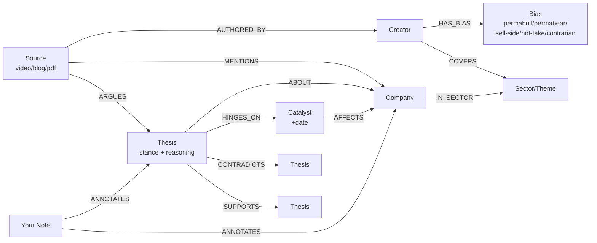

# Cognee Hackathon — Master Reference

*"Where's My Context?" · Jun 29 – Jul 5, 2026 · Solo · Open-Source (self-hosted) track*

> Single source of truth. All decisions below are **locked** with their reasoning, so they don't need re-deriving. This document is notes + diagrams only (Rule 9 compliant); no code until Day 1.

---

## 0. Locked decisions (with the reasoning, so you don't re-litigate)

| Decision | Choice | Why it's settled |
|---|---|---|
| New product vs. extend DesiQuant | **Build new** | Rules: projects built from scratch *after* start; only starter templates, Cognee APIs/integrations, and boilerplate allowed. A pre-existing project with minimal changes is disqualified. DesiQuant is reused as *domain knowledge*, never as a codebase. |
| Trading vs. investing | **Investing** | Far broader audience than active trading; aligns with Cognee's stated commercial sweet spot (finance/deal intelligence). |
| Niche vs. general second-brain | **Niche (investing)** | Generality flattens the knowledge graph into "documents with tags" = vector-RAG-with-labels, which *erases Cognee's differentiator*. A domain ontology is what forces the graph to be genuinely graph-shaped and produces wow-queries. Breadth is claimed for free in the closing pitch ("the engine generalizes"), not built. |
| Solo vs. team | **Solo** | Scope must be ruthless: one demo scenario, end-to-end. |
| Open-source vs. Cloud track | **Open-source (self-hosted Cognee)** | Targeting the "Best Use of Open Source" prize; self-hosting on own VPS. |
| LLM/embeddings: self-host vs. API | **API (Gemini/OpenAI)** | Still counts as open source — the tracks split on *where Cognee runs*, not where the LLM runs. Cognee Cloud also uses an LLM under the hood. The open-source artifact being judged is the Cognee engine you self-host; the LLM is a swappable dependency. *(Confirm once in Discord — free to ask.)* Local models via Ollama are possible but not worth it on 8 GB for a demo. |
| Hosting | **New, separate VPS for the month** | Clean isolation; zero risk to live DesiQuant; snapshot/wipe freely during the sprint. |

---

## 1. The product (one-liner)

Indian retail investors drown in fragmented investing content — finfluencer YouTube, Substacks, broker PDFs, blogs — and retain almost none of it. This turns everything you consume into a **queryable, bias-aware, contradiction-aware investing brain**: a knowledge graph of companies, theses, catalysts, sources, *creator biases*, and your own notes, that you interrogate and that sharpens over time.

**Why it's a Cognee showcase, not a vector-DB demo:** the value is the *graph*. The killer queries are multi-hop joins (creator → bias → thesis → company → catalyst; thesis ↔ contradicting-thesis) that pure vector RAG structurally cannot answer.

---

## 2. North-star demo scenario (build toward this one thing)

Pick **one real, widely-covered, divergent-opinion stock** where finfluencers genuinely clash. Ingest ~12–15 real sources about it plus 2–3 adjacent sector pieces. The live demo runs queries the audience can *feel* are impossible without a graph:

1. "Bull case vs bear case on **X**, and who argues each side."
2. "Where do the creators I follow **contradict each other** on this stock?"
3. "Which saved theses **hinge on a catalyst due this quarter**?"
4. **(bias query)** "Show bullish theses on X that come *only* from creators with a consistent **permabull** bias" — i.e. which optimism to discount.
5. "How did my view of **X evolve** across everything I consumed over 6 months?"

Then: add 3 fresh sources live → `improve()` → graph consolidates, a new contradiction edge appears. Finally `forget()` a debunked thesis → it and its derived edges vanish. End on the rendered graph.

---

## 3. The graph schema (the heart — three layers)

**Layer 1 — Stock backbone** (entities & market structure)
**Layer 2 — Bias/stance** (the creative differentiator: judgment, not just recall)
**Layer 3 — Your personal layer** (notes + collected resources)



**Node types:** Source, Creator, Company, Sector/Theme, Thesis (`stance`: bullish/bearish/neutral + 1-line reasoning), Catalyst (`date`), **Bias** (tag on creators/sources), Note (your annotations).

**Differentiating edges:** `CONTRADICTS`/`SUPPORTS` (thesis↔thesis), `HINGES_ON` (thesis→catalyst), `HAS_BIAS` (creator→bias). These three are the relationships no vector store holds — they are the demo.

**The bias layer unlock:** tagging each thesis with its source's stance *and* bias lets you ask "discount this optimism because its only support is permabull creators / sell-side-incentivized sources." That makes the tool feel like it has judgment — the thing judges remember.

**Extraction prompt (draft as notes pre-start):** per source, the LLM extracts → companies mentioned; theses (claim + stance + reasoning); catalysts (event + date + affected company); sector tags; and a bias signal for the creator. Tuning this on Day 3 is make-or-break — protect that day.

---

## 4. The four lifecycle ops → concrete contracts

| Op | What it does here | Backed by |
|---|---|---|
| **remember(source)** | Ingest URL/text → extract entities/theses/catalysts/bias → write nodes + edges, tagged to a NodeSet | `add()` + `cognify()` |
| **recall(question)** | Natural language → hybrid graph + vector search → multi-hop answers | Cognee `search` |
| **improve() / memify** | Merge duplicate company/thesis nodes; create `CONTRADICTS` edges; link new theses to prior analogues; roll up per-company consensus + bias-weighting | `memify` + consolidation pass |
| **forget(target)** | Delete a debunked thesis / untrusted creator / stale source + derived edges | `delete` / prune |

Most teams ship only `remember` + `recall`. Showing `improve` (contradiction detection) and `forget` *visibly in the demo* is free differentiation on "Best Use of Cognee."

---

## 5. Data sources & ingestion (all unblocked — no PAN, no identity APIs)

| Source | How | Notes |
|---|---|---|
| YouTube | `youtube-transcript-api` → transcript | Core source; highest volume. |
| Blogs / Substack | Scrape HTML → readable text | Cache raw text. |
| PDFs (broker/AR excerpts) | Text extraction | Optional; adds gravitas. |
| Your notes | Manual paste | → `Note` nodes (personal layer). |
| Broker CSV | User export | Optional v2 — links theses to real positions. Skip for v1. |

Every source → plain text → `add()` → `cognify()`, tagged with a Cognee **NodeSet** (by source-type or watchlist) for scoped queries.

---

## 6. VPS architecture (self-hosted, low-RAM — fits 8 GB easily)

```
Next.js frontend (graph viz + query UI + "ask-me" chat tab)
        │  HTTP
FastAPI backend  ──  remember / recall / improve / forget
        │
Cognee (self-hosted, open source)
   ├─ Graph store:   embedded (file-based)
   ├─ Vector store:  embedded (file-based)
   ├─ Relational:    SQLite
   └─ LLM + embeddings: Gemini / OpenAI API   ← offloaded, keeps RAM tiny
```

- Offload LLM + embeddings to API — do **not** self-host models (that's what would blow 8 GB).
- Use embedded file-based stores, not separate Postgres/Neo4j/Qdrant servers.
- Separate VPS (or Docker Compose) so the sprint can't touch DesiQuant.
- **Harden the box first:** keys-only SSH (disable root password login), `ufw` allowing only 22/80/443, `fail2ban`.
- **Pre-ingest the demo corpus before recording** — `cognify` is the slow step; the live demo only queries / improves / forgets, never waits on ingestion.

---

## 7. Seven-day solo build plan

- **Day 0 (pre-start, notes only):** finalize schema; lock the demo stock; collect the source URL list; draft extraction prompts. ← *current*
- **Day 1:** VPS hardening + Cognee install; `cognify` one transcript end-to-end; confirm graph populates.
- **Day 2:** ingestion pipeline (YouTube + blog → text → add → cognify) + NodeSets.
- **Day 3:** tune extraction prompts until theses/catalysts/stance/bias come out clean. *Highest-risk day — protect it.*
- **Day 4:** recall — hybrid search; build and verify the 5 showcase queries.
- **Day 5:** frontend — graph viz (`react-force-graph`/d3) + query box + "ask-me-from-my-perspective" chat tab.
- **Day 6:** `improve()`/memify (contradictions) + `forget()`; pre-ingest full demo corpus; polish.
- **Day 7:** record cinematic demo, write README + architecture diagram, submit.

**Cut order if behind:** chat tab → PDF source → `forget` UI (keep as API call). **Never cut** the contradiction/bias graph or the graph viz — those are the win.

---

## 8. Demo script (~3 min)

1. Empty graph: "It knows nothing yet."
2. Load pre-ingested corpus → graph blooms.
3. Bull vs bear query → cited answer + subgraph highlight.
4. Contradictions query → `CONTRADICTS` edges flare. *The moment.*
5. Bias query → "discount this bullishness, it's all permabulls." *Shows judgment.*
6. Catalyst-due-this-quarter query → time-aware answer.
7. Add 3 sources live → `improve()` → new contradiction edge appears.
8. `forget()` a debunked thesis → it vanishes.
9. Close on full graph: "Everything you watched, now a brain you can ask — and it generalizes to any domain."

---

## 9. Judging-criteria map

- **Impact** — large, real pain: retail investors retain ~nothing from fragmented content.
- **Creativity** — bias-aware, contradiction-aware thesis graph; not "chat with your docs."
- **Technical** — hybrid graph + vector, multi-hop, all four lifecycle ops, self-hosted.
- **Best Use of Cognee** — memory is the spine; the graph (not vectors) carries the value; `improve` + `forget` shown.
- **UX** — rendered graph + clean query = visible, tangible memory.
- **Presentation** — content-creator background is the unfair advantage; tight demo.

---

## 10. Confirm in Discord before Day 1

- API LLM/embeddings is fine for the open-source track (expected yes).
- `forget()`/delete cascade semantics in your Cognee version.
- Any required self-host config to qualify for the open-source prize.
- Free LLM/embedding credits, if any.